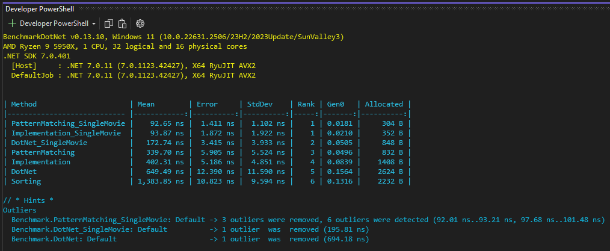

[« back](../README.md#do-you-need-to-know-how-to-implement-design-patterns) | [solution](./)
# Benchmarks 
Although the purpose of these examples is not to compare execution speeds, I thought it might be interesting to see how everything stacks up, just to satisfy curiosity.

### Benchmark Results (on my development machine)

## What do the results show?
The top three benchmarks show that Pattern-Matching offers the fastest Iterator implementation, followed very closely by my hand-cranked Iterator implementation, whereas the .net Iterator (realizes in the `IEnumerable<T>` implementation) takes almost twiceas long. Admittedly, we are only talking nanoseconds here, but depending upon how many times one is going to iterate over a collection, it could be prudent (in time critical solutions) to implement your own Iterator, however, .net 8.0 is on the horizon, and there could well be some significant improvements with that.

I think that the pattern matching implementation comes out top because it makes use of a `span<T>` under the covers, but I've not looked into that to confirm my suspicions.

I think however that for the most part, i.e. for most use cases, the .net Iterator implementation (`IEnumerabe, IEnumerable<T>`) will do the job just fine, and is probably the way to go except for a very vew outlier solutions.

## Running the benchmarks
From the solution root directory
> dotnet build Benchmarks -c Release

> dotnet .\Benchmarks\bin\Release\net7.0\Benchmarks.dll

From the Benchmarks project directory
> dotnet build -c Release

> dotnet .\bin\Release\net7.0\Benchmarks.dll

