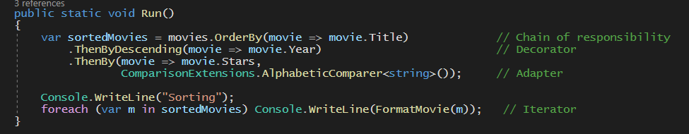

[« back](../README.md#do-you-need-to-know-how-to-implement-design-patterns) | [solution](./)
# Multiple Design Patterns in just a few lines of code

This example program demonstrates how the oblivious engineer *_is_* making use of several design patterns whilst being completely in the dark about it. 

As you can see from the image below, these six lines of code (which could "technically" be considered as just three lines of code), contain a total of **four** design patterns

1. Iterator
2. Adapter 
3. Decorator, and
4. Chain of Responsibility

