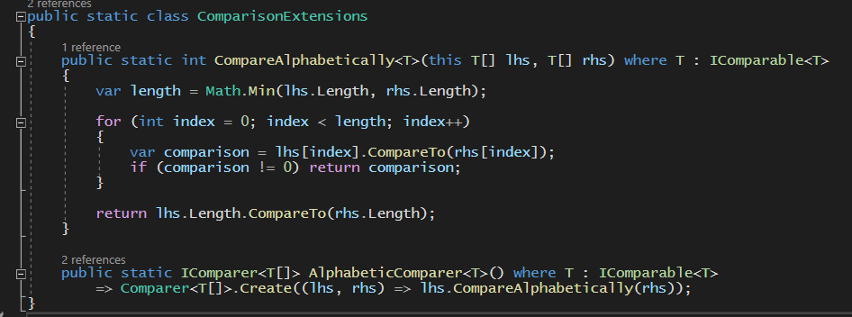

[« back](../README.md#do-you-need-to-know-how-to-implement-design-patterns) | [solution](./)
# Multiple Design Patterns in just a few lines of code

This example program demonstrates how the unwitting engineer *_is_* making use of several design patterns whilst being completely oblivious of that fact. 

As you can see from the image below, these six lines of code (which could "technically" be considered as just three lines of code), contain a total of **four** design patterns

1. Iterator
2. Adapter 
3. Decorator, and
4. Chain of Responsibility

I have indicated within the code where each pattern is used

The use of the `Adapter Pattern` might not be immediately obvious, so it's probably worth my while pointing out that I have created a couple of methods to provide *alphabetical sorting*, and these constitute an implementation of the `Adapter` pattern

